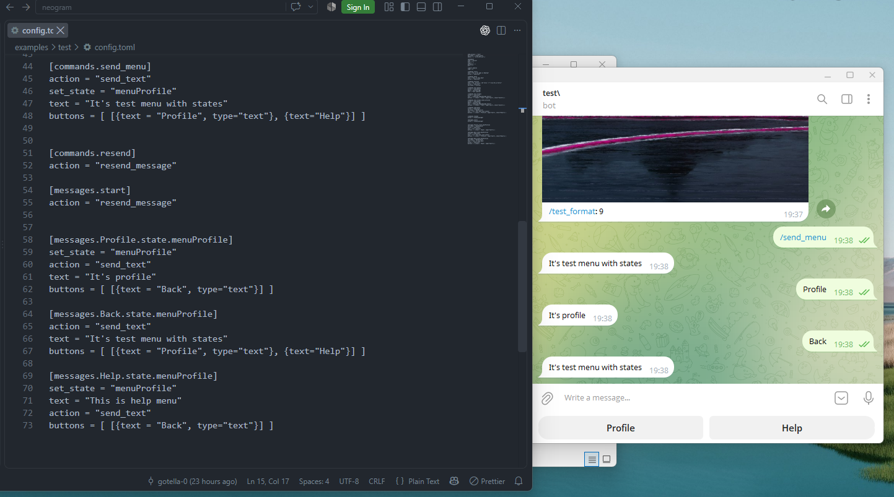

# NeoGram

**Low-code, config-driven Telegram bot framework built on top of aiogram 2.x.**

NeoGram lets you build Telegram bots by writing a single `config.toml` file instead of
imperative code. Define commands, messages, callbacks, file handling, states, buttons
and the database connection declaratively — NeoGram turns it into a running bot.

> **Note on multiprocessing / performance**
> The project started with a multi-process architecture, but multiprocessing does **not**
> bypass the Python GIL, and for an I/O-bound bot it only adds overhead. NeoGram now runs
> on a single asyncio process (`Api`) and offloads blocking database calls to worker
> threads via `asyncio.to_thread`.

## Screenshot 

This is screenshot of work bot from examples(test):




## Features

- **Config-driven**: describe the whole bot in TOML — no glue code required.
- **Commands, messages, callbacks, files**: register each handler declaratively.
- **States**: multi-step conversations with per-user state stored in the database.
- **Buttons**: inline and reply keyboards defined in config.
- **Media**: receive and store photos, audio, voice, documents, video, location, contact.
- **Send actions**: text, photo, document, edit message, resend.
- **Databases**: MySQL and SQLite out of the box.
- **Custom modules & logic**: import your own Python modules and call them from config.
- **Simple CLI**: `create`, `run`, `remove` a project.

## Quick start

```bash
pip install neogram
neogram create my_bot          # answer the database questions
# edit my_bot/config.toml: put your bot token and admins
neogram run my_bot
```

The generated project structure:

```
my_bot/
├── assets/        # photos, documents used in send_photo / send_document
├── modules/       # optional custom Python modules (imported via config)
└── config.toml    # the entire bot logic
```

## Documentation

The full documentation lives in the [`docs/`](docs/README.md) folder and is split by topic:

- [Installation](docs/installation.md)
- [Getting started — your first bot](docs/getting-started.md)
- [Configuration (`config.toml`)](docs/configuration.md)
- [States & multi-step dialogs](docs/states.md)
- [Buttons & keyboards](docs/buttons.md)
- [Files & media handling](docs/files-media.md)
- [Send actions (`send_text`, `send_photo`, ...)](docs/actions.md)
- [API reference (`Api` methods)](docs/api-reference.md)
- [Examples walkthrough](docs/examples.md)

Русская версия документации: [docs/ru/](docs/ru/README.md).

## Requirements

- Python 3.8+
- aiogram 2.20, SQLAlchemy 1.4, PyMySQL, mysql-connector-python, toml

## License

Copyright © 2022 Nikita Smirnov. All rights reserved.
